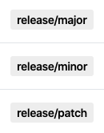

# Action Release Label

[![actions-workflow-lint][actions-workflow-lint-badge]][actions-workflow-lint]
[![release][release-badge]][release]
[![license][license-badge]][license]

This is a GitHub Action to output a semver update level `major, minor, patch` from a pull request *release* label.

For example, if a pull request has the label `release/minor`, this action outputs `minor` as level.

It would be more useful to use this with other GitHub Actions' outputs.

It's recommended to use this with [actions-ecosystem/action-bump-semver](https://github.com/actions-ecosystem/action-bump-semver) and [actions-ecosystem/action-push-tag](https://github.com/actions-ecosystem/action-push-tag).

## Inputs

|      NAME      |                               DESCRIPTION                               |   TYPE   | REQUIRED |            DEFAULT            |
|----------------|-------------------------------------------------------------------------|----------|----------|-------------------------------|
| `label_prefix` | A prefix for labels that indicate semver level `{major, minor, patch}`. | `string` | `false`  | `release/`                    |
| `event`        | An event that triggers this action. Must be a pull request event.       | `string` | `false`  | `${{ toJson(github.event) }}` |

## Outputs

|  NAME   |                  DESCRIPTION                   |   TYPE   |
|---------|------------------------------------------------|----------|
| `level` | A semver update level `{major, minor, patch}`. | `string` |

## Note

This action is inspired by [haya14busa/action-bumpr](https://github.com/haya14busa/action-bumpr).

## License

Copyright 2020 The Actions Ecosystem Authors.

Action Release Label is released under the [Apache License 2.0](./LICENSE).

<!-- badge links -->

[actions-workflow-lint]: https://github.com/actions-ecosystem/action-release-label/actions?query=workflow%3ALint
[actions-workflow-lint-badge]: https://img.shields.io/github/workflow/status/actions-ecosystem/action-release-label/Lint?label=Lint&style=for-the-badge&logo=github

[release]: https://github.com/actions-ecosystem/action-release-label/releases
[release-badge]: https://img.shields.io/github/v/release/actions-ecosystem/action-release-label?style=for-the-badge&logo=github

[license]: LICENSE
[license-badge]: https://img.shields.io/github/license/actions-ecosystem/action-add-labels?style=for-the-badge
